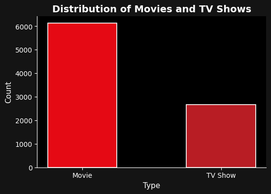
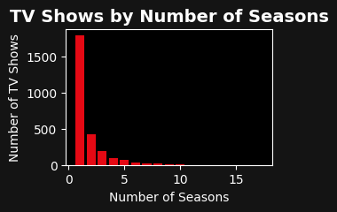
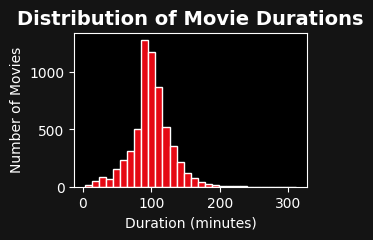

# 🎬 Netflix Content Analysis

Exploratory Data Analysis (EDA) on Netflix's movies and TV shows catalog — uncovering trends in content type, growth over the years, country-wise distribution, and duration patterns.

## 📊 Dataset
- Source: [Netflix Movies and TV Shows (Kaggle)](https://www.kaggle.com/datasets/debayank2024/netflix-movies-and-series)
- ~8,800 titles with details like type, cast, country, release year, rating, and duration

## 🛠️ Tools & Libraries
- Python, Pandas, NumPy
- Matplotlib, Seaborn
- Jupyter Notebook

## 🔍 Key Insights
- Netflix's catalog is dominated by Movies (~70%), with TV Shows making up a smaller share (~30%)
- Content additions peaked around 2020, showing Netflix's biggest catalog expansion during that period
- The United States leads content production, followed by India

## 📈 Sample Visualizations

📌 *For the complete analysis with all visualizations, check out [netflix.ipynb](netflix.ipynb)*

## 🚀 How to Run
1. Clone this repo
2. Install dependencies: `pip install pandas numpy matplotlib seaborn`
3. Open `netflix.ipynb` in Jupyter Notebook

---
Made by [Muskan Panchal] | [www.linkedin.com/in/muskan-panchal-840b72411]
